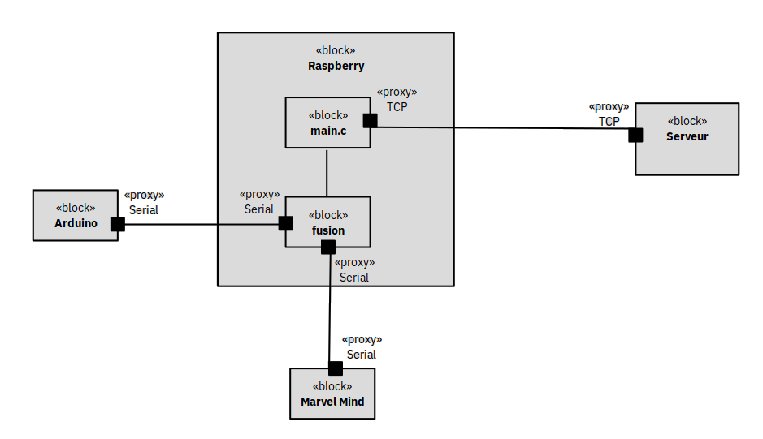
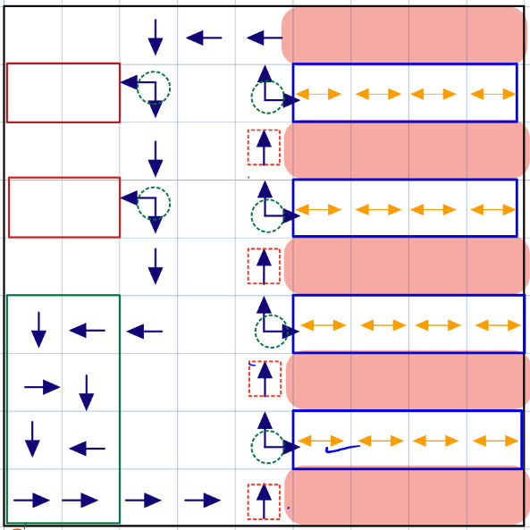

# flotain

Contient les codes pour le projet de gestion d'un entrepôt avec une flotte de robots.

## Modélisation et choix techniques




On limite le trajet des robots à des routes prédéterminées, ce qui permet de réduire les problèmes de synchronisation. On utilisera un gestionnaire de ressource pour gérer les croisements.



## Structure du projet

```
.
├── Arduino
│   └── Flotain_moteur
│       ├── Flotain_moteur.ino
│       ├── Functions_motor.ino
│       └── Serial_Test.py
├── libinet
│   ├── data.h
│   ├── html/
│   ├── latex/
│   ├── libinet.a
│   ├── libinetdebug.a
│   ├── man/
│   ├── session.h
│   ├── useLibInet.c
│   ├── useLibInetClient
│   └── useLibInetSrv
├── PC
│   └── gestionnaire.o
├── Pi_Robot
├── Raspberry
│   ├── bin/
│   ├── include
│   │   ├── carte.h
│   │   ├── commons.h
│   │   ├── data.h
│   │   ├── driver_robot.h
│   │   ├── main.h
│   │   ├── network.h
│   │   └── session.h
│   ├── libinet.a
│   ├── libinetdebug.a
│   ├── main
│   ├── makefile
│   └── src
│       ├── carte.c
│       ├── driver_robot.c
│       ├── main.c
│       ├── network.c
│       ├── serial_client.c
│       └── serveur.c
└── README.md

```

`PC` contient les codes à faire tourner sur l'ordinateur qui contrôle le système.

`Raspberry` contient les codes à faire tourner sur le megapi des robots.

`Arduino` contient les codes à téléversé sur les arduinos des robots afin de contrôler les moteurs.

## Get started

### Raspberry

Pour compiler les codes dans le dossier `Raspberry`, on peut faire
```bash
make
```

Cela créera des fichiers objets `.o` dans le dossier `bin`, et l'exécutable `./main` lié statiquement.

Note : Il faut le faire sur le Raspberry, ou cross-compiler pour ARM.

### Arduino

Envoyer les fichiers sur l'arduino :
```bash
scp -r Flotain_moteur pi@robot1.local:/home/pi
```

Compiler et uploader depuis la raspberry:
```bash
arduino-cli compile --fqbn arduino:avr:mega Flotain_moteur/
arduino-cli upload -p /dev/ttyUSB0  --fqbn arduino:avr:mega Flotain_moteur/
```

## Commande

Le dossier `Commande` contient des codes pour contrôler le robot. Les détails ont été données à la soutenance. Le code n'est aps inclus dans `Raspberry` car il n'est pas encore utilisable.
